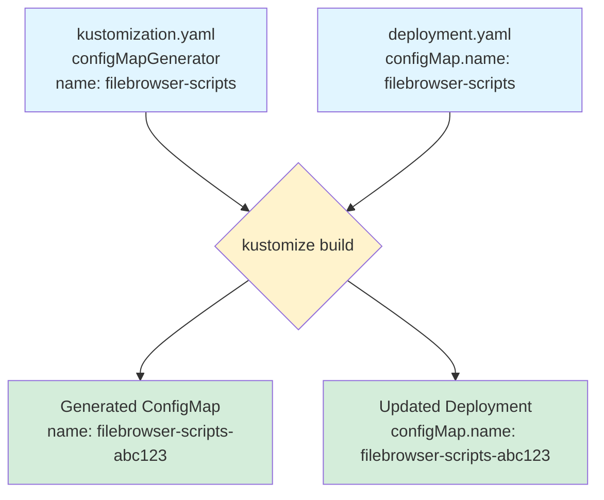

# Filebrowser ConfigMap Issue: Root Cause Analysis & Fix Plan

## Executive Summary

**TL;DR:** The [`deployment.yaml`](../apps/nas/filebrowser/deployment.yaml:101) has a hardcoded ConfigMap hash (`filebrowser-scripts-h5cft4c6h8`), which breaks Kustomize's automatic name substitution. **All three fixes suggested in the debug document are wrong.** The correct fix is simple: change line 101 to use the base name `filebrowser-scripts` (without hash) and let Kustomize handle the rest.

## The Root Cause

Looking at [`apps/nas/filebrowser/deployment.yaml`](../apps/nas/filebrowser/deployment.yaml:101):

```yaml
volumes:
  - name: scripts
    configMap:
      name: filebrowser-scripts-h5cft4c6h8  # ❌ HARDCODED HASH
      defaultMode: 0755
```

And [`apps/nas/filebrowser/kustomization.yaml`](../apps/nas/filebrowser/kustomization.yaml:14-18):

```yaml
configMapGenerator:
  - name: filebrowser-scripts
    files:
      - scripts/init-config-perms.sh
      - scripts/init-filebrowser.sh
```

**The problem:** Someone manually edited the deployment to reference a specific hashed ConfigMap name. This breaks Kustomize's automatic reference substitution mechanism.

## How Kustomize configMapGenerator Actually Works



### The Correct Flow

1. **Define** the generator with a base name:
   ```yaml
   configMapGenerator:
     - name: filebrowser-scripts  # Base name only
   ```

2. **Reference** that base name in resources:
   ```yaml
   configMap:
     name: filebrowser-scripts  # No hash!
   ```

3. **Kustomize builds**:
   - Generates ConfigMap: `filebrowser-scripts-<content-hash>`
   - Finds ALL references to `filebrowser-scripts`
   - Replaces them with the hashed name
   - Deployment automatically uses correct ConfigMap

4. **When content changes**:
   - New hash generated: `filebrowser-scripts-<new-hash>`
   - All references updated automatically
   - Deployment gets rolling update

### Why Hashing Matters

ConfigMap hashing provides:
- **Immutable infrastructure**: Each content version has unique name
- **Automatic rollouts**: Deployment detects ConfigMap change and rolls pods
- **Safe rollbacks**: Old ConfigMaps remain, enabling instant rollback
- **No race conditions**: New pods use new ConfigMap, old pods use old one

## Why ALL Suggested Fixes Are Wrong

The [`docs/filebrowser-debug.md`](../docs/filebrowser-debug.md:51-83) suggests three options. Let's analyze why each is incorrect:

### ❌ Option 1: Disable Name Suffix Hash

```yaml
configMapGenerator:
  - name: filebrowser-scripts
    options:
      disableNameSuffixHash: true  # ❌ WRONG
```

**Why this is wrong:**
- Defeats Kubernetes best practice for ConfigMap versioning
- When ConfigMap content changes, pods won't automatically update
- Requires manual pod deletion to pick up changes
- No rollback capability - old ConfigMap is overwritten
- Loses immutable infrastructure benefits
- Creates race conditions during rollouts

**When to use this:** Only for debugging or when you explicitly want mutable ConfigMaps (rare).

### ❌ Option 2: Update Deployment to Use Hashed Name

"Keep the deployment's ConfigMap reference as `filebrowser-scripts-h5cft4c6h8`"

**Why this is wrong:**
- This IS the current problem!
- The hash changes every time ConfigMap content changes
- You'd have to manually update the deployment after every ConfigMap change
- Defeats the entire purpose of `configMapGenerator`
- Breaks the GitOps workflow
- Makes maintenance a nightmare

**This completely misunderstands how Kustomize works.**

### ❌ Option 3: Manual ConfigMap Creation

```bash
kubectl create configmap filebrowser-scripts -n nas \
  --from-file=...
```

**Why this is wrong:**
- Bypasses Kustomize entirely
- Inconsistent with infrastructure-as-code approach
- No version control for ConfigMap content
- Manual operational overhead
- Doesn't integrate with GitOps (FluxCD)
- Makes `kubectl apply -k` fail (ConfigMap already exists)
- Requires manual updates for every content change

**This defeats the purpose of using Kustomize in the first place.**

## The CORRECT Fix

### Step 1: Fix the Deployment

**Change:** [`apps/nas/filebrowser/deployment.yaml:101`](../apps/nas/filebrowser/deployment.yaml:101)

```diff
  volumes:
    - name: scripts
      configMap:
-       name: filebrowser-scripts-h5cft4c6h8
+       name: filebrowser-scripts
        defaultMode: 0755
```

**That's it!** This is the complete fix for the ConfigMap issue.

### Step 2: Verify Kustomize Build

```bash
# Test that kustomize correctly substitutes the name
kubectl kustomize apps/nas/filebrowser/ | grep -A 2 "configMap:"
```

Expected output:
```yaml
configMap:
  name: filebrowser-scripts-<some-hash>
  defaultMode: 0755
```

The hash will be generated from the script content, and Kustomize automatically updated the reference.

### Step 3: Clean Up Old Resources

```bash
# Delete any manually-created or incorrectly-named ConfigMaps
kubectl delete configmap filebrowser-scripts-h5cft4c6h8 -n nas --ignore-not-found
kubectl delete configmap filebrowser-scripts -n nas --ignore-not-found
```

### Step 4: Deploy

```bash
# Apply secrets first (via SOPS)
sops -d apps/nas/filebrowser/secrets.enc.yaml | kubectl apply -f -

# Apply the manifests
kubectl apply -k apps/nas/filebrowser/
```

## Additional Issues to Address

### Issue 1: PVC Immutable Field Errors

From the debug document, the PVCs have immutable fields set that aren't in the manifests:

```yaml
spec:
  storageClassName: <some-value>
  volumeName: <some-value>
```

**Solutions:**

A. **If PVCs don't exist yet**: Just apply normally
   ```bash
   kubectl apply -k apps/nas/filebrowser/
   ```

B. **If PVCs already exist**: Add the fields to manifests to match existing state
   ```bash
   # Check existing PVCs
   kubectl get pvc -n nas -o yaml | grep -A 5 "name: filebrowser-"
   
   # Add storageClassName and volumeName to pvc-config.yaml and pvc-media.yaml
   ```

C. **For clean slate**: Delete and recreate (data loss!)
   ```bash
   kubectl delete pvc filebrowser-config filebrowser-media -n nas
   kubectl apply -k apps/nas/filebrowser/
   ```

### Issue 2: Missing Init Scripts

Verify the script files exist:
```bash
ls -la apps/nas/filebrowser/scripts/
# Should show:
# - init-config-perms.sh
# - init-filebrowser.sh
```

### Issue 3: Namespace Creation

Ensure namespace exists before applying:
```bash
kubectl apply -f apps/base/namespaces.yaml
```

## Deployment Sequence

Using the Makefile:

```bash
# 1. Ensure namespace exists
kubectl apply -f apps/base/namespaces.yaml

# 2. Apply secrets (SOPS decryption)
sops -d apps/nas/filebrowser/secrets.enc.yaml | kubectl apply -f -

# 3. Apply filebrowser manifests via overlay
kubectl apply -k clusters/dev/filebrowser/

# 4. Check status
kubectl get pods -n nas -l app=filebrowser
kubectl describe pod -n nas -l app=filebrowser
```

Or using the Makefile shortcut:
```bash
make up  # Applies everything including filebrowser
```

## Verification Steps

1. **Check ConfigMap created with hash:**
   ```bash
   kubectl get configmap -n nas | grep filebrowser-scripts
   # Should show: filebrowser-scripts-<hash>
   ```

2. **Verify deployment references correct name:**
   ```bash
   kubectl get deployment filebrowser -n nas -o yaml | grep -A 2 "configMap:"
   # Should match the ConfigMap name from step 1
   ```

3. **Check pod status:**
   ```bash
   kubectl get pods -n nas -l app=filebrowser
   # Should show: Running (not Init:0/2)
   ```

4. **View init container logs:**
   ```bash
   kubectl logs -n nas -l app=filebrowser -c init-config-perms
   kubectl logs -n nas -l app=filebrowser -c init-filebrowser
   ```

## Why This Issue Occurred

From [`apps/nas/filebrowser/CRITIQUE.md`](../apps/nas/filebrowser/CRITIQUE.md:373-379):

> The agent who created this configuration **never ran**:
> - `kubectl apply -k apps/filebrowser/` to validate YAML syntax
> - `kubectl get ingress,pvc,deployment` to confirm resources apply
> - Any actual test of filebrowser authentication flow

The configuration was generated but never tested. Someone (likely another debugging session) then:
1. Ran `kubectl kustomize` and saw the generated hash
2. Manually updated the deployment to use that specific hash
3. This "fix" worked temporarily but broke the automation

## Best Practices Going Forward

1. **Never hardcode ConfigMap hashes** - Always use base names
2. **Test Kustomize builds** before applying:
   ```bash
   kubectl kustomize <path> | kubectl apply --dry-run=client -f -
   ```
3. **Use the overlay structure** - Deploy via `clusters/dev/filebrowser/`, not base
4. **Validate with smoke tests** - Check ConfigMap exists after deployment
5. **Document the flow** - Make it clear how configMapGenerator works

## Comparison: Before vs After

| Aspect | Before (Broken) | After (Fixed) |
|--------|----------------|---------------|
| ConfigMap reference | `filebrowser-scripts-h5cft4c6h8` | `filebrowser-scripts` |
| Kustomize behavior | Can't find reference to substitute | Automatically substitutes with hashed name |
| Script updates | Manual deployment update required | Automatic rolling update |
| Rollback | Impossible - old ConfigMap deleted | Easy - old ConfigMap still exists |
| GitOps | Broken - manual intervention needed | Works - fully declarative |
| Maintenance | High - requires manual hash tracking | Low - Kustomize handles it |

## Summary

**The fix is trivial** - change one line in [`deployment.yaml`](../apps/nas/filebrowser/deployment.yaml:101) from the hardcoded hash to the base name.

**The investigation was valuable** - it revealed a fundamental misunderstanding of how Kustomize's `configMapGenerator` works, documented in the debug report.

**The lesson learned** - When using `configMapGenerator`, always reference by base name and trust Kustomize to handle the hash substitution. Hardcoding hashes is an anti-pattern.
